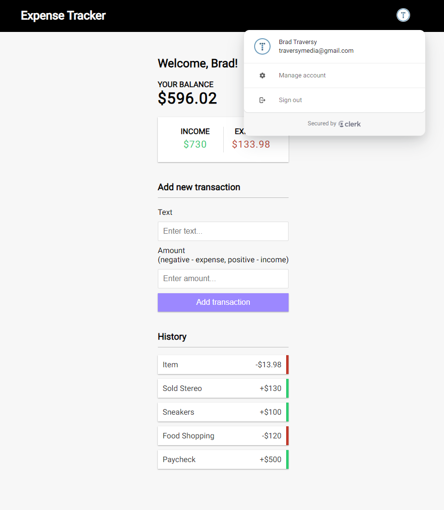

# Expense Tracker (Next.js, TypeScript, Neon & Clerk)

Application for tracking income and expenses. It uses Next.js with [Neon](https://fyi.neon.tech/traversy) to persist data and [Clerk](https://go.clerk.com/BsG2XQJ) for authentication.

[Watch The Tutorial](https://www.youtube.com/watch?v=I6DCo5RwHBE)

[Try Demo](https://traversydemos.dev)

<div style="text-align:center;margin:30px auto;">
  
</div>

## Usage

### Install dependencies:

```bash
npm install
```

### Add Environment Variables:

Rename the `.env.example` file to `.env.local` and add the following values:

- `DATABASE_URL`: Your db string from https://neon.tech
- `NEXT_PUBLIC_CLERK_PUBLISHABLE_KEY`: Your Clerk public frontend API key from https://dashboard.clerk.dev/settings/api-keys
- `CLERK_SECRET_KEY`: Your Clerk secret key from https://dashboard.clerk.dev/settings/api-keys

Run the development server:

```bash
npm run dev
```

Open [http://localhost:3000](http://localhost:3000) with your browser to see the result.
